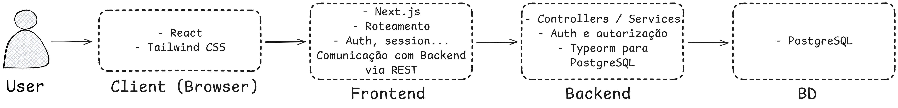

# Arquitetura do Projeto

## 🧰 Tecnologias Utilizadas

| Camada         | Tecnologias                                         |
| -------------- | --------------------------------------------------- |
| Frontend       | Next.js 15+, TailwindCSS, Shadcn UI, NextAuth       |
| Backend        | NestJS, Prisma ORM                                  |
| Banco de Dados | PostgreSQL                                          |
| Infra          | GitHub Actions (CI), Vercel (CD)                    |
